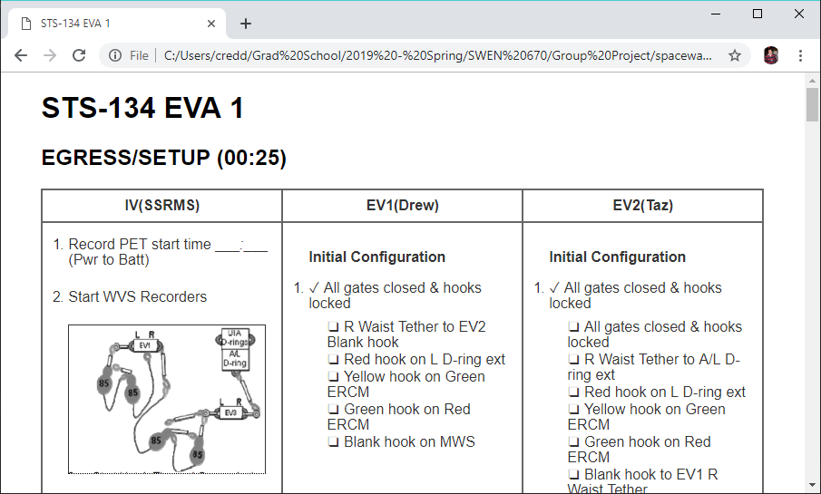
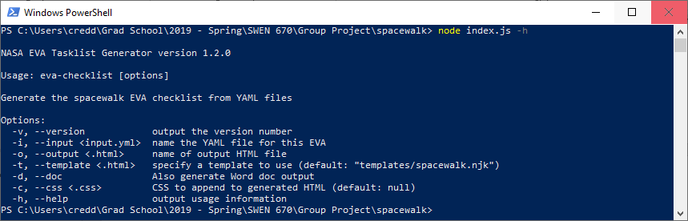
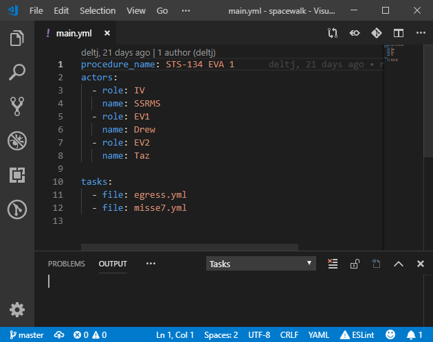
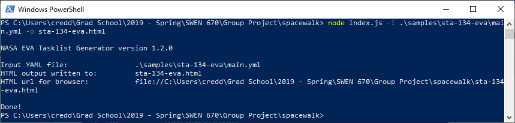

# EVA-Task-Generator
**Last Updated by Ebony Christian 4/28/2019**

## User Guide for Phase II EVA Task Generator Project
The purpose of the EVA Task Generator project is to replace the manual procedure creation process for Extravehicular Activities (EVAs) by NASA, Johnson Space Center personnel. The goal of the application is to take an EVA checklist in a YAML file format as input, and output a Word document in the standard procedure format with minimal post processing required.

## Motivation
This software intends to assist NASA personnel in the performance and management of tasks during “space walks” outside the International Space Station (ISS) or future vehicles. The primary objective of the project is to automate and organize the creation of task lists used in space walks and ensure that they are easily accessed and can be updated by stakeholders. 

## Build status

[](https://travis-ci.org/deltj/spacewalk)
[](https://deepscan.io/dashboard#view=project&tid=3139&pid=4624&bid=37151)

## Code style

[](https://github.com/feross/standard)
 
## Screenshots

*EVA Task Generator HTML Output Example*


*EVA Task Generator Help Feature*


*EVA Task Generator Input File Example*


*EVA Task Generator Successful Execution*


## Installation
The following are step by step instructions for how to get the NASA EVA Task Generator development environment installed and running. The software can be run on Window, Linux, and Mac OS.

1. Install [node LTS version]( https://nodejs.org/en/download/).
2. Install [Visual Studio Code]( https://code.visualstudio.com/download).
3. Clone the NASA EVA Task Generator “spacewalk” repository from GitHub  
 ```git clone https://github.com/jamesmontalvo3/spacewalk.git```
4. Navigate into the project directory, using command `cd spacewalk` 
5. Use NPM to install the module, using command `npm install` 
6. Install the EVA Task Generator `npm install -g evachecklist`
7. Check the install is working by running help menu `node index.js -h` or the version `node index.js -v`

## How to Use \ User Instructions
The following files demostrates how to use the application features via the console command line. 

*EVA Task Generator CSS- Customizable & scalable CSS template*
**docs/qna/images/CSS Demo.mp4**
[](https://www.youtube.com/watch?v=l8NPJTH6QzU "Click to play CSS Demo on YouTube.com")

*EVA Task Generator Pandoc- HTML-to-Word Conversion*
**docs/qna/images/Pandoc Demo.mp4**
[](https://www.youtube.com/watch?v=G60tPv9cM08 "Click to play Pandoc Demo on YouTube.com")

*EVA Task Generator URL- Externally Reference Files*
**docs/qna/images/URL Demo .mp4**
[](https://www.youtube.com/watch?v=uTopcel6VpA "Click to play URL Demo on YouTube.com")

## API Reference

Libraries used include nunjucks for CSS template customization, chai assertion for unit testing, and pandoc for HTML-to-Word file conversion.

See [YAML Definition]( docs/yamlDefinition.md) for an overview of YAML file syntax. This link also provides details on how NASA JSC writes procedures in the YAML files format for EVA Tasks and how the EVA Task Generator uses the data dictionary to parse YAML files. 

## Tests

# Unit Testing

This directory contains unit tests for the spacewalk project. Unit tests are
automatically run by travis-ci after commits are made to this repo, and the
build status is reported by a badge in the README.md in the project root.

Spacewalk unit tests use the Chai Assertion Library for assertions in unit
tests. More information here: https://www.chaijs.com/api/bdd/

To manually execute unit tests (which you should do BEFORE committing changes):

```bash
npm test
```

Mocha will generate a nice test report for you.

* If any of the unit tests fail, you should fix them.
* If statement coverage is below 50%, you should add more tests.

# Integration Testing

Run the program with sample YAML files.
The following samples may be run from within the spacewalk directory
- Sample using local files 
`node index.js --input samples/sta-134-eva/main.yml --output sta-134-aqua.html’
- Sample with CSS on command line
`node index.js --input samples/sta-134-eva/main.yml --css samples/sta-134-eva/custom.css --output sta-134-aqua.html`
- Sample with CSS specified in input YAML file
`node index.js --input samples/sta-134-eva/maincss.yml --output sta-134-aqua.html`
- Sample with CSS on both command line and within input file
`node index.js --input samples/sta-134-eva/maincss.yml --css samples/sta-134-eva/custom.css --output sta-134-aqua.html`
-Sample with docx output
`node index.js --input samples/sta-134-eva/maincss.yml --css samples/sta-134-eva/custom.css --output sta-134-aqua.html -d`
Or
`node index.js --input samples/sta-134-eva/maincss.yml --css samples/sta-134-eva/custom.css --output sta-134-aqua.html -d *outputfile.docx*`

## Credits

*NASA Project Sponsor*
James Montalvo

*UMUC Phase II Development Team, Spring 2019*
Akruthi Shetty
Christopher Redding
Ebony Christian
Joe Bidinger
Ted Deloggio

*UMUC Phase I Development Team, Fall 2018*
Jose De la Cruz
Jason Foley
Alexandra Kuntz
Engedawork Befekadu
Timothy Smith"
Christopher Drury
Kevin Terry
John-Carlo Babin


## License
The NASA EVA Task Generator uses MIT and Apache licensed open source software
