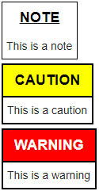

NASA EVA Task Generator – Week 5 Questions
------------------------------------------

Below is a list of questions asked by a group of students from UMUC who are going to be working on this project. This project is is not being done in connection with NASA, and all statements and other contributions by James Montalvo are his own and may not reflect the position of NASA. All reference material is in the public domain.

### Will the intro YAML have a beginning section defining roles and names?

Example from main.yml lines 65-69:

```yaml
actors:
  role: IV/SSRMS
  role: EV1
  name: Drew
  role: EV2
  name: Taz
```

Answer: Yes, I think it makes sense to include this block in the `main.yml` file.

### Where does the yaml file declare `task = __` and `applied = __`? Where blank is the number of EV's involved.

`main.yml` shows that there should exist conditionals but `egress.yml` and `misse7.yml` is missing this text.

Answer: I think you're saying there needs to be some input into each included file, indicating how many and who the actors involved are. So rather than just doing:

```yaml
tasks:
  - file: egress.yml
  - file: misse7.yml
```

Perhaps something like this:

```yaml
tasks:
  - file: egress.yml
    actors:
      - IV/SSRMS
      - EV1
      - EV2

  - file: misse7.yml
    actors:
      - IV/SSRMS
      - EV1
      - EV2
```

### Can we get a sample of single-person-task.yml?

Answer: I'll work to create one. In the mean mean time, I think just-EV1 and just-EV2 tasks would be added like this:

```yaml
tasks:
  - file: something-just-ev2-is-doing.yml
    actors:
      - IV/SSRMS
      - EV2

  - file: something-just-ev1-is-doing.yml
    actors:
      - IV/SSRMS
      - EV1
```

Note that in both cases I've added `IV/SSRMS` since we'll almost always have some steps in that column.


### Are notes, warnings, and cautions expected to appear in the YAML files such as page FS 7-208 or FS 7-177 to FS 7-183?

Answer: For your purposes we only care about inline notes/cautions/warnings. You can see an example of a caution and a warning inline on page 7-188. Nowadays we style those blocks a little differently. Here's an example:



### Are there different ways to annotate substeps with parenthesis? misse7.yml line 153 and 157 are substeps in the pdf annotated with parenthesis.

Answer: `misse7.yml` line 153 and 157 are the second step lines in each of these:

```yaml
    EV1:
      - step: Glove and Gauntlet check
      - step: Translate aft to Bay 9 - MISSE 8 Retrieve (line 153)

    EV2:
      - step: Glove and Gauntlet check
      - step: Translate aft to S3 Face 1 - S3 CETA Light Install (line 157)
```

In the STS-134 procedure page 7-23 these steps are formatted like:

EV1:
```
17. Glove and Gauntlet Check
      (Translate aft to Bay 9 – MISSE 8 Retrieve)
```

EV2:
```
19. Glove and Gauntlet Check
    (Translate to S3 Face 1 – S3 CETA Light Install)
```

So I believe your question is: why doesn't the YAML include anything indicating to put those in parenthesis? My answer: I don't believe there's any reason to put them in parenthesis or to consider them anything other than a normal step, so I've made them in the YAML look like a normal step. Their output should look like this instead:

EV1:
```
17. Glove and Gauntlet Check
18. Translate aft to Bay 9 – MISSE 8 Retrieve
```

EV2:
```
19. Glove and Gauntlet Check
20. Translate to S3 Face 1 – S3 CETA Light Install
```

### Do you wish to use a reserved word “footer” where it appends below a step in parenthesis?

Answer: No, I don't think that's necessary.

### We noted multiple syntax elements that have some similarity: check and checkmark – would you be able to clarify the differences between them? (e.g. EVA 1 EGRESS/SETUP).

It looks like I used `{{CHECK}}` once and otherwise used `{{CHECKMARK}}`. I'll change that one instance to `{{CHECKMARK}}`. I think adding "MARK" to the end clarifies that it's not an empty checkbox.

